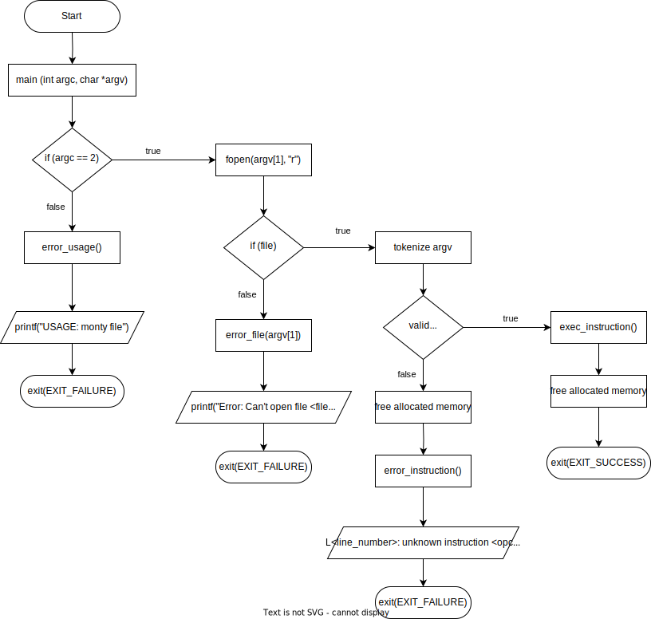

# C - Stacks, Queues - LIFO, FIFO

## Table of contents

   * [Resources](#resources)
   * [Learning Objectives](#learning-objectives)
   * [Quiz Answers](#quiz-answers)

## Resources

* [How do I use extern to share variables between source files in C?](https://stackoverflow.com/questions/1433204/how-do-i-use-extern-to-share-variables-between-source-files)

__DATA STRUCTURES__

__1. QUEUES__
- [Data Structure and Algorithms - Queue - tutorialspoint](https://www.tutorialspoint.com/data_structures_algorithms/dsa_queue.htm)
- [Queue Data Structure - geeksforgeeks](https://www.tutorialspoint.com/data_structures_algorithms/dsa_queue.htm)
- [Queue Data Structure - programiz](https://www.programiz.com/dsa/queue)
- [Data Structures 101: Queues - freecodecamp](https://www.freecodecamp.org/news/data-structures-101-queues-a6960a3c98/)
- [Linear Data Structures: Linked Lists, Stacks, and Queues in JS - freecodecamp](https://www.freecodecamp.org/news/linear-data-structures-linked-lists-stacks-and-queues-in-javascript-a13c7591ad87/)
- [A Gentle Introduction to Data Structures: How Queues Work - freecodecamp](https://www.freecodecamp.org/news/a-gentle-introduction-to-data-structures-how-queues-work-f8b871938e64/)

__2. STACKS__
- [Introduction to Stacks - NesoAcademy](https://www.youtube.com/watch?v=I37kGX-nZEI&ab_channel=NesoAcademy)
- [Data Structures 101: Stacks - freecodecamp](https://www.freecodecamp.org/news/data-structures-101-stacks-696b3282980/)
- [A Gentle Introduction to Data Structures: How Stacks Work - freecodecamp](https://www.freecodecamp.org/news/data-structures-stacks-on-stacks-c25f2633c529/)

__Project: Monty Interpreter__
- [The Design of Monty: a Programming/Scripting Language - sciencedirect](https://www.sciencedirect.com/science/article/pii/S1571066105051820)
- [The Monty programming language](https://montyscoconut.github.io/)
- [How To Create An Interpreter Of Bytecodes In Fifteen Minutes](https://www.smartspate.com/how-to-create-an-interpreter-of-bytecodes/)

__Project: Monty Interpreter Flowchart v1__

- link: https://drive.google.com/file/d/1_SoJnkqARuwR0PYTqqJ3LpddBS2cwGIu/view?usp=sharing

## Learning Objectives

- What do LIFO and FIFO mean
- What is a stack, and when to use it
- What is a queue, and when to use it
- What are the common implementations of stacks and queues
- What are the most common use cases of stacks and queues
- What is the proper way to use global variables

## Quiz answers

__Question #0__

Which of these methods are keeping the order of insertion? 
- FIFO
- LILO

__Question #1__

Which of these stacks are reversing the order of insertion? 
- FILO
- LIFO

__Question #2__

What’s the command used to add a new element to a stack?
- push

__Question #3__

What’s the command used to remove a new element from a stack?
- pop

[Go up](#table-of-contents)